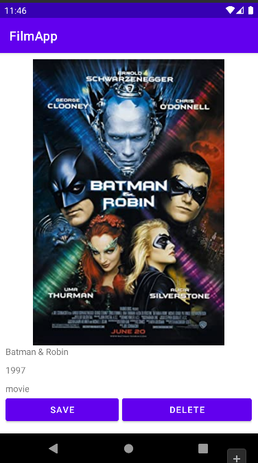

# Film Track App

This application is developed by Tolga KALAYCIOĞLU for SENG-405 Lesson. 

Student Number: 201711040

This application simulates a Film Track App. It was implemented on Android Studio in Java Programming Language. 

It includes options that include save and delete to watch list and search films.

Download APK -> [FilmApp](https://github.com/tolgak99/FilmTrackApp/blob/master/FilmTrackApp.apk?raw=true)

